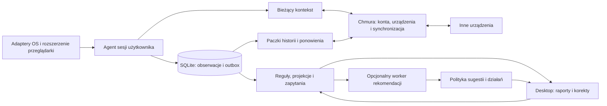

# FocusWatch — decyzja o nowej implementacji i architekturze

> **Status: rekomendacje zakończonego badania.** Nie oznaczają zatwierdzenia przez użytkownika całego stosu ani rozpoczęcia rewrite. Bieżący kontekst: [handoff](../../HANDOFF.md), [brief](../../PROJECT_BRIEF.md), [rejestr decyzji](../../architecture/DECISIONS.md), [plan implementacji](../../IMPLEMENTATION_PLAN.md).

Stan badania: **27 września 2026**. Rekomendacje dotyczą rozpoczęcia budowy produktu; nie są deklaracją gotowości do wdrożenia produkcyjnego. Badanie obejmuje inspekcję obecnego repo, dokumentację dostawców i konkurentów, lokalne próby oraz odtwarzalny model kosztów. Nie wdrażano zasobów chmurowych ani nie wysyłano prywatnej historii.

## Rekomendacja

**Zbudować FocusWatch od początku w obecnym repozytorium.** Nowe granice procesów, model danych i raporty są lepiej dopasowane do celu niż adaptery podtrzymujące obecną implementację. Historia Git i doświadczenia pozostają źródłem wiedzy. Nie wymagamy kompatybilności, równoległego utrzymania starej aplikacji, migracji ani odtworzenia wszystkich funkcji. Jest to wybór inżynierski dla obecnego zakresu, a nie dowód, że refaktor byłby niemożliwy. [Inspekcja i porównanie trzech dróg](rewrite-assessment.md).

Pierwszy rezultat służy właścicielowi projektu, ale architektura od początku uwzględnia komercyjny produkt osobisty: oddzielne konta i urządzenia, instalację, aktualizacje, prywatność, eksport, usuwanie danych i diagnozowanie problemów. Nie jest to produkt do nadzoru pracowników.

| Obszar | Proponowany wybór | Dowód i granica pewności |
| --- | --- | --- |
| Agent desktopowy | **Rust, osobny proces sesji użytkownika**, adaptery Windows/X11 i przeglądarki | Mocne uzasadnienie niezależności od UI; syntetyczne próby awarii. Rust jest wyborem implementacyjnym dla natywnych integracji i dystrybucji, nie zwycięzcą benchmarku języków. Python pozostaje technicznie wykonalny |
| Interfejs | **React + TypeScript w Electron**, uruchamiany na żądanie | Wspólny frontend zmierzono też w Tauri. Electron wybieramy za dostarczany Chromium i wynik rysowania; płacimy pamięcią. Qt Quick jest zmierzoną, znacznie lżejszą alternatywą. Wybór warunkowy do sprawdzenia na rzeczywistym Windows/Linux |
| Dane lokalne | **SQLite WAL + atomowy outbox + odbudowywalne agregaty** | Zapytania i rozmiar zmierzone przy 1 mln i 10 mln obserwacji; próby awarii transakcji oraz semantyki czasu |
| API chmury | **Jeden modułowy serwis Rust/Axum + SQLx** przy wyborze Rust w rdzeniu | Ogranicza liczbę stosów; nie ma pomiaru przewagi nad Go/FastAPI/Fastify/.NET. Najbliższa alternatywa: Go + pgx |
| Dane serwera | **PostgreSQL dla stanu operacyjnego**, archiwum w obiektach | Obserwacje mogą być odczytywane w PG tylko w wariancie cloud-readable; przy E2EE pozostają metadane i ewentualne zaszyfrowane paczki. Test 1 mln jawnych rekordów nie waliduje komercyjnego obciążenia wielu kont ani E2EE |
| Długa analityka | **Parquet + DuckDB do konkretnych skanów/zadań** | Skan 10 mln szybszy niż SQLite; małe odczyty dnia wolniejsze. Nie dodawać DuckDB do każdego klienta bez potrzeby |
| Bieżący kontekst | **WebSocket**, osobny od paczkowanej historii | Udokumentowane zachowanie platform; szybki kanał nie zastępuje trwałego zapisu ani ACK historii |
| Chmura | **GCP: Cloud Run, Cloud SQL, GCS w Belgii** jako środowisko pierwszego wdrożenia | Wybór operacyjny oparty na udokumentowanym RT i HA; nie zwycięzca pełnego TCO. Scaleway jest głównym konkurentem kosztowym |
| Infrastruktura | **Kontenery OCI i OpenTofu**, oddzielne środowiska; lokalnie opcjonalny Compose dla usług | Konkretny, przenośny sposób wdrożenia. Kubernetes nie rozwiązuje obecnie wykazanego problemu i dodaje obsługę klastra |

Nie uzasadniamy Reacta hipotetycznie obowiązkową aplikacją webową. Raporty desktopowe są wystarczającym zastosowaniem. Portal konta/płatności może powstać osobno. Mobilne companiony i przyszłe urządzenia nie muszą dzielić powłoki desktopowej; powinny dzielić semantykę i protokół.

## Co rzeczywiście zmierzono

Pomiary wykonano na użytkowanym laptopie i7-6700HQ/32 GB, z danymi syntetycznymi i rozgrzaną pamięcią podręczną. To próby wyborów architektonicznych, nie benchmark gotowego produktu.

| Pytanie | Wynik | Konsekwencja |
| --- | --- | --- |
| Czy lokalna wieloletnia historia wymaga nowego silnika bazy? | Przy **10 mln** rekordów SQLite: strona dnia 500 rekordów **2,41 ms**, podsumowanie roku z projekcji **8,69 ms** | Pozostawić SQLite; raporty mają pobierać ograniczone wyniki |
| Czy surowe skany są tym samym problemem? | Suma całej historii: SQLite **3282 ms**, DuckDB/Parquet **184 ms**, projekcje SQLite **121 ms** | Codzienne raporty opierać na projekcjach; DuckDB ma rolę w swobodnej analityce |
| Ile zajmują dane? | 10 mln: SQLite z indeksami **4,83 GB**, dodatkowe projekcje **12,55 MB**, Parquet **520 MB** | Oddzielić wielkość transmisji, magazynu operacyjnego i archiwum; kompresja syntetyczna nie jest prognozą wszystkich danych |
| Czy wolny odczyt X11 dowodzi konieczności zmiany języka? | Ten sam Python: stałe Xlib **0,124–0,167 ms**, dwa procesy xdotool **10,9–14,8 ms** — zakres median partii | Zmienić sposób integracji z OS; ten wynik nie porównuje Python/Rust |
| Czy podstawy awarii/czasu są sprawdzalne bez całej aplikacji? | **10/10** scenariuszy czasu/outbox/retry oraz **10/10** scenariuszy lifecycle/framing | Te same zachowania mają wejść do kontraktu nowego rdzenia; to nie certyfikat gotowego sync |
| Czy mały natywny relay wymaga dużej pamięci na same połączenia? | Próby **250/500/1000 WebSocketów**: szczyt PSS procesu serwera **3,76/5,69/9,55 MiB**, sprawdzone dostarczenie komunikatów | To wykonalność prostego transportu dla stałej grupy klientów; bez TLS, auth, PostgreSQL, churn i pamięci gniazd kernela. Nie potwierdza pojemności Cloud Run |

10 mln odpowiada około **7,13 roku** wyłącznie przy przyjętym scenariuszu 3840 obserwacji/dzień: dwa urządzenia, po dwa źródła, osiem godzin i checkpointy co 30 sekund. Nie oznacza siedmiu lat dowolnej intensywności ani przechowywania treści ekranów. Agregaty aplikacji w pomiarze sumują czas źródeł; nie mierzą uwagi człowieka. Pełne wyniki, metoda, wersje i ograniczenia: [dane](data-results.md), [metodologia](data-evaluation.md), [desktop i adaptery](desktop-comparison.md).

Tauri nie dostało domyślnej rekomendacji na podstawie reputacji „lekkiego Electrona”. Porównujemy rzeczywiste procesy Tauri/WebKitGTK, Electron i Qt Quick. Qt wykazuje istotną przewagę pamięci; Electron daje argument za wspólnym silnikiem raportów. Krótka próba Canvas w programowym renderowaniu nie dowodzi jakości całego interfejsu, wydajności GPU, zużycia baterii ani wyniku na Windowsie. Raport powinien ograniczać szczegółowość do widocznego zakresu, niezależnie od frameworka.

W końcowej serii **1000 segmentów** mediana PSS trzech uruchomień wyniosła **56,6 MiB Qt Quick**, **244,5 MiB Tauri** i **322,2 MiB Electron**. Mediany odstępów między poleceniami odrysowania były bliskie 16–17 ms we wszystkich trzech wariantach. Electron przekracza zaproponowany w badaniu cel 300 MiB; użytkownik nie ustanawiał takiego limitu. Rekomendacja świadomie akceptuje większy koszt otwartego UI, oddzielonego od stałego kosztu agenta. Gdyby niska pamięć interfejsu stała się kryterium nadrzędnym, wybrałbym Qt Quick. Nie wykonano porównania React/Vue/Svelte; wybór Reacta nie jest twierdzeniem o przewadze jego renderowania. [Wyniki desktopu](desktop-results.md), [model procesów Electron](https://www.electronjs.org/docs/latest/tutorial/process-model).

## Podział systemu

Agent działa po zamknięciu UI i bez sieci. Jest właścicielem lokalnego zapisu. UI korzysta z ograniczonego, wersjonowanego IPC i API raportowego; nie materializuje całej historii. Natywny host rozszerzenia przekazuje dane do agenta, ale nie staje się daemonem zależnym od życia przeglądarki. Blokowanie otrzyma osobny helper z zakresem uprawnień wymaganym przez system; nie należy przez to uruchamiać całego collectora lub UI jako administrator.

**Historia i bieżący kontekst mają inne gwarancje.** Historia jest zapisana przed wysyłką, ponawiana i potwierdzana po trwałym przyjęciu. Kontekst przekazuje najnowszy stan; po reconnect trzeba go odświeżyć. Stary snapshot staje się „nieznany”, a nie „użytkownik nieaktywny”. Proponowane cele <1 s lokalnie i <5 s między urządzeniami wymagają pomiaru kompletnej implementacji. [Kontrakt, transport i fan-out](realtime-design.md).

W chmurze dane ostatnich okresów mogą być operacyjne, starsze szczegóły spakowane, a raporty liczone z wersjonowanych projekcji. „90 dni gorących danych” jest parametrem kosztorysu, nie przyjętą polityką produktu. Nie ustalamy obowiązku kasowania wieloletniej historii. Lokalnie też można z czasem pobierać szczegóły na żądanie zamiast powielać wszystko na każdym urządzeniu.

## Model ma zachować pełny cel produktu

Badanie 11 rozwiązań daje trzy praktyczne wskazówki: reguły, ręczne korekty i wiele urządzeń już występują na rynku; sposób łączenia równoległych źródeł jest ważniejszy od samego hasła „multi-device”; retencja szczegółów, dostęp do raportów i synchronizacja nie oznaczają tego samego. ActivityWatch dostarcza przykład niezależnych watcherów, ManicTime i Timing — różnych zasad przeliczania historii, Cold Turkey i Freedom — zależności blokad od systemu i uprawnień. Hipotezą wyróżnienia FocusWatch jest połączenie równoległego kontekstu z wyjaśnialnymi korektami i osobistym planowaniem. Nie wykazano jeszcze unikalności ani skuteczności tej kombinacji. [Mechanizmy i źródła porównania](competitors.md).

| Warstwa | Przykład i zasada |
| --- | --- |
| **Obserwacja** | VSCode na foreground, grający stream, stan telefonu. Źródło, czas, jakość i pochodzenie; równoległe fakty pozostają oddzielne |
| **Interpretacja** | „Praca nad projektem”, „możliwa regeneracja”. Wersja reguły/modelu, materiał źródłowy i niepewność; wynik może się zmienić |
| **Intencja** | Plan dnia, cel, wartość lub ograniczenie podane przez użytkownika. Aplikacja działa bez deklarowania kierunku życiowego |
| **Profil osobisty** | Potwierdzone preferencje i hipotezy o wzorcach/pitfalls; widoczne, edytowalne, usuwalne, z datą i pochodzeniem. Domysł modelu nie staje się trwałym faktem o osobowości |
| **Korekta i feedback** | Ręczne przypisanie aktywności, ocena sugestii, odrzucenie planu. Przeliczenie reguł nie nadpisuje po cichu decyzji użytkownika |
| **Polityka działania** | Kiedy sugerować, limity przerwań, wyciszenie, uprawnione blokady i uzgodniony override. Sugestia AI nie przyznaje sobie prawa wykonania |

Nie wybieramy jednego „prawdziwego foreground” ze wszystkich urządzeń i nie dzielimy uwagi automatycznie po równo. Czas osoby można liczyć jako unię przedziałów, a ekspozycję na media i inne źródła osobno. Współwystępowanie streamu z mniejszą wydajnością nie dowodzi ani szkodliwości, ani ochrony przed wypaleniem.

Personalizacja zaczyna się od edytowalnych reguł, kategorii, zakresu pomiarów i ustawień interwencji. Nie wymaga od razu publicznego systemu pluginów ani wykonywania dowolnego kodu użytkownika.

AI powinno dostawać wybrane dane i funkcje zapytań, nie lata surowych zdarzeń w jednym promptcie. Deterministyczna warstwa zapewnia czas, agregaty, priorytet korekt, limity i uprawnienia. Model może interpretować, proponować i planować. Worker inferencji pozostaje osobny, z limitem CPU/RAM i możliwością wyłączenia. **Nie wybrano modelu LLM ani nie zmierzono jego jakości lub opóźnień na tym sprzęcie.** Lokalny i chmurowy wariant należy później porównać na tych samych scenariuszach z oceną użytkownika, liczbą korekt, opóźnieniem i kosztem. Nie jest to warunek rozpoczęcia użytecznej aplikacji pomiarowej.

## Chmura: rekomendacja z warunkami

Porównanie obejmuje GCP, AWS, Scaleway oraz warianty Cloudflare; Hetzner jest odniesieniem dla samodzielnej administracji. Cloudflare nie był kryterium wejściowym. [Źródła i pełny rachunek](cloud-comparison.md), [parametry](cloud-cost-inputs.json), [kalkulator](../../../scripts/research/cloud_costs.py).

Przy **1000 użytkowników**, pięciu latach zgromadzonej historii, minutowej synchronizacji i wspólnym referencyjnym koszyku bazy częściowy model **wariantu cloud-readable** daje około **398 EUR/mies. GCP**, **230 EUR Scaleway**, **418 EUR AWS**, **246 EUR Workers + zewnętrzny PostgreSQL**. To nie cena gotowej produkcji ani dowód, że referencyjna baza wystarczy do tej liczby użytkowników. Nie obejmuje m.in. inferencji, wszystkich zadań analitycznych, pełnego fan-out RT, obsługi i skalowania bazy.

Stałe połączenia mogą odwrócić wynik. W modelu dwóch aktywnych urządzeń na użytkownika przez osiem godzin dziennie, przy **założeniu 250 połączeń na instancję**, GCP daje około **435 EUR**, a Scaleway przy limicie 80 — około **444 EUR**. Przy innej faktycznej pojemności wynik się zmienia. Limit platformy i lokalny test WebSocket nie są pomiarem pojemności instancji w chmurze.

**Dlatego GCP rekomenduję do pierwszego wdrożenia części serwerowej, z umiarkowaną pewnością.** Przemawiają za nim udokumentowane WebSockety, regionalne HA bazy oraz uruchamianie natywnego kontenera. Scaleway może wygrać kosztami, jeśli zweryfikujemy jego rzeczywisty kanał RT i zaakceptujemy inną granicę HA. Workers/Durable Objects mogą później uzasadnić tani relay; dodanie drugiego dostawcy wymaga policzenia całej integracji. Żaden z tych wniosków nie dowodzi najniższego wieloletniego TCO.

Kontenery i IaC są uzasadnione od pierwszego serwera. Kubernetes, Kafka, oddzielny magazyn kolumnowy klasy ClickHouse oraz stale działający klaster ML czekają na konkretny problem i pomiar; skala historii jednej osoby ich nie wymusza.

OpenTofu jest propozycją deklaratywnego opisu zasobów, z przeglądem planu zmian i osobnym stanem środowisk. Nie wykonano benchmarku narzędzi IaC; Terraform lub Pulumi również mogą obsłużyć ten zakres. OCI ułatwia przeniesienie programu, ale definicje usług, tożsamości i migracja danych nadal zależą od dostawcy. [Dokumentacja OpenTofu](https://opentofu.org/docs/).

## Decyzje otwarte i warunki zmiany rekomendacji

Najważniejsza otwarta decyzja to **granica prywatności chmury**. Serwer odczytujący obserwacje może liczyć raporty i interpretacje. Przy E2EE przechowuje paczki i przekazuje kontekst, a analityka treści działa na uprawnionym urządzeniu. Wybór zmienia koszty, odzyskiwanie dostępu i zasadność wspólnego silnika domenowego na serwerze. Oba warianty są opisane i mają częściowe modele kosztowe; żadnego nie uznajemy za zaakceptowany. Decyzja jest potrzebna przed implementacją synchronizacji rzeczywistych danych, nie przed lokalnym rdzeniem.

| Wybór | Co może go zmienić / co sprawdzić w implementacji |
| --- | --- |
| Rust agent | Równoważny prototyp Python okaże się wyraźnie prostszy w dystrybucji i utrzymaniu przy spełnieniu budżetu zasobów; dziś nie zmierzono przewagi języka |
| Electron UI | Qt Quick daje lepszy kompletny raport przy istotnym dla produktu budżecie pamięci; Tauri sprawdza się lepiej na rzeczywistych platformach. Potrzebne GPU, klawiatura, skalowanie, instalacja i aktualizacja, nie kolejne identyczne mikrobenchmarki |
| Axum API | Blind-sync ograniczy wspólną domenę, a równoważny endpoint Go uprości rozwój lub istotnie obniży rzeczywisty koszt |
| PostgreSQL w chmurze | Wielotenancki test wykazuje wąskie gardło ingestu/raportów mimo właściwych indeksów, retencji i projekcji; dopiero wtedy testować inny magazyn analityczny |
| GCP | Pełny test synchronizacji i rachunek operacyjny pokażą trwałą przewagę innego dostawcy przy wymaganej niezawodności |

Windows i Arch/X11 są pierwszymi adapterami. Wayland wymaga macierzy compositorów; Android/iOS mają inne uprawnienia i granice obserwacji. Cross-platform UI nie znosi tych ograniczeń. Nie obiecujemy na telefonie ciągłego feedu odpowiadającego desktopowi. Smart glasses pozostają kolejnym typem źródła, bez wyboru SDK przed wyborem urządzeń. [Dokumentacja platform i blokowania](desktop-comparison.md).

## Następny krok: pierwszy przekrój nowego produktu

1. Zapisać kontrakt obserwacji, czasu, źródeł, korekt i query API oraz przykłady akceptacyjne. Przenieść wiedzę ze starych testów, bez przenoszenia starego schematu jako wymagania.
2. Zbudować osobnego agenta Windows/X11, SQLite/outbox i źródło przeglądarkowe, w tym media w tle. Sprawdzić suspend/resume, awarię UI i agenta, brak uprawnień, brak miejsca oraz luki pomiaru.
3. Dostarczyć raport dnia i okresu, nakładanie źródeł, ręczne korekty, reguły, eksport i widoczny stan pomiaru. UI pobiera strony/agregaty. Ta wersja ma być użyteczna bez LLM i bez deklarowania celów życiowych.
4. Po decyzji o prywatności dołączyć drugie urządzenie: trwały sync, bieżący kontekst, revocation, reset/usuwanie, reconnect i pomiar opóźnień. Zweryfikować koszty w wybranej chmurze.
5. Na wiarygodnych danych porównać rekomendacje/reguły i AI; następnie dodawać dobrowolne interwencje oraz platformowe blokowanie. Zakres wynika z wartości dla użytkownika, nie z feature parity starej aplikacji.

To kolejność realizacji pełnej wizji, nie ograniczenie produktu na zawsze do trackera. Podpisane wydania, spójne aktualizacje agenta/UI i testy instalacji muszą towarzyszyć pierwszej dystrybuowanej wersji. Pomiary badań nie zastępują tych prac.

## Materiał do weryfikacji

- [Obecny kod i wybór rewrite](rewrite-assessment.md).
- [11 produktów: mechanizmy, ograniczenia i hipotezy wyróżnienia](competitors.md). To analiza dokumentacji/kodu, nie test skuteczności wszystkich aplikacji.
- [Desktop, natywne integracje i próby](desktop-comparison.md).
- [Metoda pomiarów danych](data-evaluation.md), [czytelne wyniki](data-results.md), [SQLite/DuckDB JSON](data-results.json), [PostgreSQL JSON](postgres-results.json), [scenariusze semantyki](sync-semantics-results.json).
- [Pięć stosów backendowych](backend-comparison.md), [realtime i synchronizacja](realtime-design.md).
- [Surowy wynik lokalnej próby WebSocket](realtime-results.json), z wersjami, hashami źródeł i ograniczeniami.
- [Porównanie chmur](cloud-comparison.md), [założenia i oficjalne ceny](cloud-cost-inputs.json), [wyniki kalkulatora](cloud-cost-results.json).
- [Skrypty badań](../../../scripts/research/). Zbiory, buildy i zależności są w ignorowanym `build/research`; nie stanowią części nowej aplikacji.
